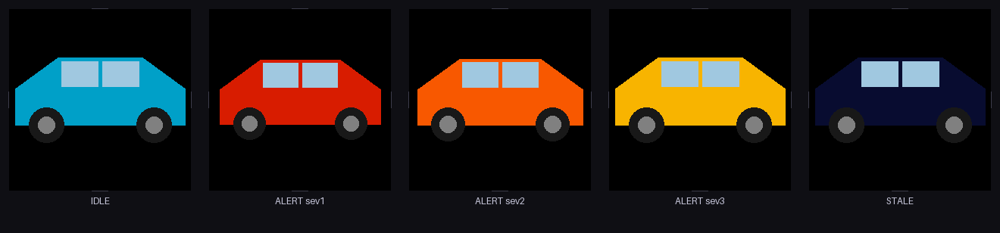

# pc/ — ESP32-S3 Traffic Monitor (PC side)

The PC-side script that polls traffic near your location and signals the
ESP32-S3 display over USB serial.

---

## Display Simulator — `display_sim.py`

A PC-side renderer of the five static round-display visual states. Colors,
radii, and geometry are mirrored from `src/display_anim.cpp`, so the live
preview and exported images are close visual references for the firmware output.

### Quick start

```powershell
# Install required dependency (Pillow — also install pygame for live mode)
pip install pillow
pip install pygame        # optional, only needed for live window

# Headless export — no display required; writes GIFs + PNGs to pc\preview\
python pc\display_sim.py --export pc\preview

# Interactive live window (requires pygame)
python pc\display_sim.py              # starts in IDLE state
python pc\display_sim.py --state alert2
```

### Live-mode keyboard controls

| Key | State |
|-----|-------|
| `0` | IDLE — static teal car |
| `1` | ALERT severity 1 — static vivid red car |
| `2` | ALERT severity 2 — static hot orange-red car |
| `3` | ALERT severity 3 — static amber car |
| `s` | STALE — static dim blue-grey car |
| `Esc` / `q` | Quit |

The window title shows the active state name; no text is drawn over the
simulated round screen.

### Export output (`--export <dir>`)

Writes the following files to the given directory (created if absent):

| File | Contents |
|------|----------|
| `idle.gif` / `alert1.gif` … `stale.gif` | Static GIF preview for compatibility |
| `idle.png` / `alert1.png` … `stale.png` | Static filmstrip montage preview |
| `overview.png` | All five static states side-by-side for quick comparison |

The `pc/preview/` directory is listed in `.gitignore` (regenerable artifacts).

---

## Traffic provider: TomTom Traffic Flow API

**Why TomTom?**
- **Free tier: 2,500 requests/day** — 3-minute polling uses ~480 calls/day (headroom to spare)
- No billing / credit card required
- Simple REST endpoint: returns `currentSpeed` and `freeFlowSpeed` per road segment
  → one clean ratio gives a deterministic severity level
- HERE is a solid alternative; Google Maps Platform was skipped (requires billing account)

### Get a free TomTom API key (5 minutes)

1. Go to **https://developer.tomtom.com/**
2. Click **"Sign up free"** → create an account
3. Dashboard → **My Apps** → **+ New App**
4. Give it a name, check **"Traffic"** under APIs → **Save**
5. Copy the **API key** shown on the app page

---

## Installation

```powershell
# From the repo root — create a virtual environment (recommended)
python -m venv pc\.venv
pc\.venv\Scripts\activate

# Install dependencies
pip install -r pc\requirements.txt
```

Or without a venv:
```powershell
pip install -r pc\requirements.txt
```

---

## Configuration — API key

**Never hardcode the key.** Use one of:

### Option A — Environment variable (recommended)

```powershell
# Windows CMD
set TOMTOM_API_KEY=your_key_here

# PowerShell
$env:TOMTOM_API_KEY = "your_key_here"
```

### Option B — Local config file (gitignored)

Create `pc\.traffic_config` (this file is gitignored and will never be committed):

```
TOMTOM_API_KEY=your_key_here
```

---

## Finding your COM port (Windows)

1. Plug in the ESP32-S3 via USB
2. Open **Device Manager** (Win + X → Device Manager)
3. Expand **Ports (COM & LPT)**
4. Look for **"Silicon Labs CP210x USB to UART Bridge"** or **"USB-SERIAL CH340"**
5. Note the port name, e.g. **COM3** or **COM7**

Or in PowerShell:
```powershell
python -m serial.tools.list_ports
```

---

## Running the monitor

### Prerequisites checklist

- TomTom app has the **Traffic** API product enabled, and `TOMTOM_API_KEY` is set
  in your environment or in `pc\.traffic_config`
- Python dependencies are installed with `pip install -r pc\requirements.txt`
- Traffic-display firmware is flashed to the ESP32-S3
- The ESP32-S3 is connected over USB and you know its COM port

```powershell
# Activate venv if using one
pc\.venv\Scripts\activate

# Run with your COM port and location (lat/lon of your street)
python pc\traffic_monitor.py --port COM3 --lat 40.7128 --lon -74.0060

# Alternative: --location shorthand
python pc\traffic_monitor.py --port COM3 --location 40.7128,-74.0060

# Slower poll interval: 300 seconds / 5 minutes instead of the 180-second default
python pc\traffic_monitor.py --port COM3 --lat 40.7128 --lon -74.0060 --interval 300
```

At startup, the monitor opens the serial port at 115200 baud and waits up to
5 seconds for `READY`. If `READY` is not seen, it sends `PING` and waits up to
another 5 seconds for `PONG`; if neither response arrives, it logs a warning
and continues so you can still diagnose the port/firmware. During normal mode,
it polls TomTom every 180 seconds by default (`--interval SECONDS` changes this)
and sends a heartbeat `PING` every 60 seconds so the device does not enter
`STALE` between traffic polls.

The monitor also writes an INFO-and-above rotating log to
`pc\logs\traffic_monitor.log` for persistent diagnostics. That directory is
gitignored, and TomTom API keys are scrubbed from all console and file log
output.

**Options:**

| Flag | Default | Description |
|------|---------|-------------|
| `--port` | *(required)* | COM port, e.g. `COM3` |
| `--lat` / `--lon` | *(required in normal mode)* | Latitude/longitude of your location |
| `--location LAT,LON` | — | Alternative to `--lat`/`--lon` in normal mode |
| `--interval SECONDS` | 180 | Traffic poll interval (3 min default) |
| `--test {bad\|clear}` | — | Manual QA mode (see below); no API key or location required |

---

## Manual QA — `--test` mode

Test the serial link without a live traffic API. Sends one real command
through the serial path and waits for an ACK:

```powershell
# Trigger the "bad traffic" alert display (severity 2)
python pc\traffic_monitor.py --port COM3 --test bad

# Return to calm idle
python pc\traffic_monitor.py --port COM3 --test clear
```

No API key required for `--test` mode.

---

## Scheduling on Windows (Task Scheduler)

To run the monitor automatically at startup (or on a schedule):

1. Open **Task Scheduler** (search in Start menu)
2. **Create Basic Task** → give it a name, e.g. "Traffic Monitor"
3. **Trigger:** "When the computer starts"
4. **Action:** "Start a program"
   - **Program:** `C:\path\to\repo\pc\.venv\Scripts\python.exe`
   - **Arguments:** `C:\path\to\repo\pc\traffic_monitor.py --port COM3 --lat 40.7128 --lon -74.0060`
   - **Start in:** `C:\path\to\repo\pc`
5. Under **Conditions**, uncheck "Start only if the computer is on AC power" (optional)
6. Under **Settings**, check "Run task as soon as possible after scheduled start is missed"

**Tip:** Set `TOMTOM_API_KEY` as a **System environment variable** (Control Panel →
System → Advanced → Environment Variables → System variables) so Task Scheduler
picks it up without extra configuration.

---

## Severity scale

| TomTom speed ratio | Status | Severity | Meaning |
|-------------------|--------|----------|---------|
| ≥ 0.85 | clear | — | Normal flow → `TRAFFIC OK` |
| 0.60 – 0.85 | bad | 1 | Slow / heavy traffic |
| 0.35 – 0.60 | bad | 2 | Significant delays |
| < 0.35 | bad | 3 | Gridlock |

*ratio = currentSpeed / freeFlowSpeed from TomTom API*

---

## Traffic conditions → car color

The monitor queries TomTom Traffic Flow `flowSegmentData`, computes
`currentSpeed / freeFlowSpeed`, and sends one serial command for the matching
traffic state. The firmware renders a static car: there is no animation, pulse,
flash, or brightness breathing, and it redraws only when the display
state/severity changes.



The car body colors below are sourced from `src\display_anim.cpp`. The RGB
column lists the source RGB values passed to the firmware `rgb565()` helper;
the RGB565 column is the actual packed display color. The full-width car is
about 224 px wide on the 240 px display (roughly 8 px side margins) for idle,
severity 3, and stale; lower alert severities are slightly smaller.

| Traffic condition | Status / severity | Serial command sent | Car color shown |
|-------------------|-------------------|---------------------|-----------------|
| `currentSpeed / freeFlowSpeed >= 0.85` | clear / idle | `TRAFFIC OK` | teal — RGB `(0, 160, 200)`, RGB565 `0x0519` |
| `0.60 <= currentSpeed / freeFlowSpeed < 0.85` | alert severity 1 | `TRAFFIC BAD` | vivid red — RGB `(220, 30, 0)`, RGB565 `0xD8E0` |
| `0.35 <= currentSpeed / freeFlowSpeed < 0.60` | alert severity 2 | `TRAFFIC BAD 2` | hot orange-red — RGB `(255, 90, 0)`, RGB565 `0xFAC0` |
| `currentSpeed / freeFlowSpeed < 0.35` | alert severity 3 | `TRAFFIC BAD 3` | steady amber — RGB `(255, 180, 0)`, RGB565 `0xFDA0` |
| PC link lost — no `TRAFFIC` or `PING` for 5 min | stale | none; device timeout state | dim blue-grey — RGB `(13, 13, 55)`, RGB565 `0x0866` |

---

## What to do if traffic API is down

The monitor **fails safe**: on API timeout, 5xx errors, rate-limiting (429),
or ambiguous data it logs a warning and preserves the device's current state.
It does **not** send a spurious ALERT. A 401/403 auth error stops the monitor
and logs a clear message to check `TOMTOM_API_KEY`.
